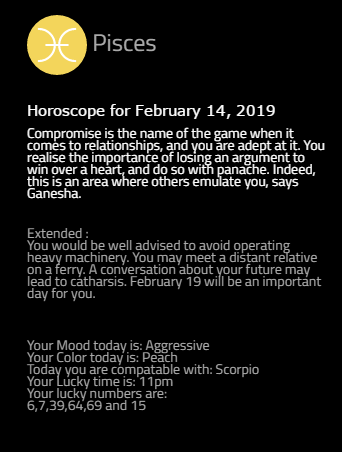
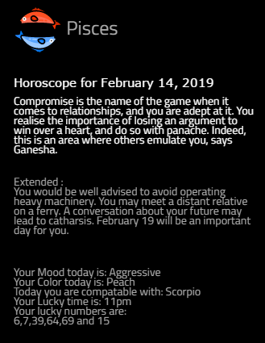
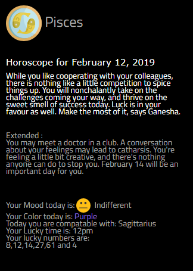
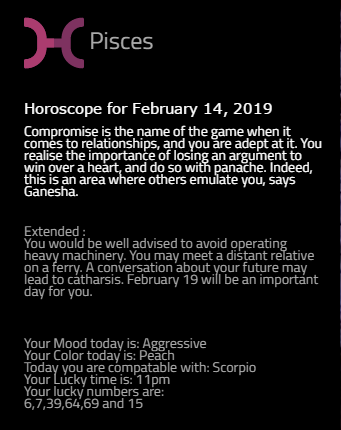

# MMM-Astro
Astrology Module for MagicMirror2

Formly MMM-Astrology 

Meet MMM-Astro with more info!

## 4 different icon sets to choose from!
 
 
 
 

## Installation
     ~MagicMirror/modules
     `git clone https://github.com/cowboysdude/MMM-Astro.git`
      cd
      ~MagicMirror/modules/MMM-Astro
      run - npm install
      
 ## Configuration options

The following properties can be configured:

| Option | Description
| --- | ---
| `sign` | The star sign to display. Must be lower case.    **Example values:** `leo`, `aries`, `pisces` **Default value:** none
| `iconSet` | The type of horoscope icon to display.    **Possible values:** `1`, `2`, `3`, `4` **Default value: 1**    
|`extend`| to show the extended forecast     **Possible values:** `true`, `false`  **Default value: true** 
 
 
 
 ## Add to Config.js
  
           {
            disabled: false,
            module: 'MMM-Astro',
            position: 'top_right',
			      config: {
			      sign: "pisces",
			      iconset: "1",
			      extend: true 
			             }
           },
          
